<div align="center">
	
    
    
	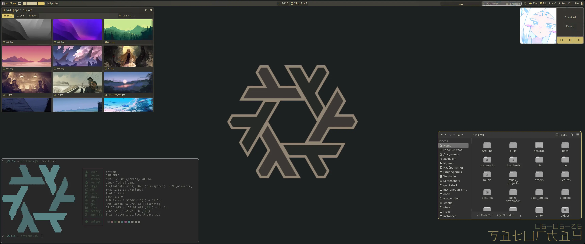
	<h1>> Just Enough Shell _</h1>
	<p>Built for daily use, not for screenshots.</p>
</div>

***

<div align="left">
	<h3>-- About -- :</h3>
	<p>
	<i>JES</i> - WM-agnostic rolling release desktop shell that supports connecting any WM natively, even custom ones.<br>
  <br>
	<i>JES</i> supports out of the box:
	<ul>
  	<li><a href="https://github.com/wlrfx/swayfx">SwayFX</a></li>
  	<li><a href="https://hypr.land/">Hyprland</a></li>
  	<li><a href="https://github.com/niri-wm/niri">Niri</a></li>
		<li><a href="https://github.com/malbiruk/driftwm">DriftWM</a></li>
		<li><a href="https://github.com/binarylinuxx/zwwm">ZWWM</a></li>
		<li>Any other via the plugin system (see <a href="./plugin_repo.md">plugin_repo.md</a>)</li>
	</ul>
	<br>
	The project has optimization, but it has not been tested on <b>very</b> weak PCs.<br>
	Go binaries are used for scripts where fast reading of a large data stream is important; thanks to this, idle CPU load for <i>JES</i> is 1–2% and ~450 MB RAM, instead of 35–45%.<br>
  <br>
	The project has a simple plugin system, making it extensible.<br>
	<br>
	<i>JES</i> was designed for desktop PCs, which is why there can be architectural issues with laptops.<br>
	Verified resolutions: FHD (1920×1080) and higher.<br>
	On these the panel has no issues with module placement.<br>
	Multiple monitors are natively supported.<br>
	<br>
	The project survived a switch from eww to qs and will not be abandoned, because it is inseparably linked to the author's daily life and community requests; it will evolve and improve further.<br>
	<br>
  <i>JES is oriented not toward trends, but toward practicality in everyday use and convenience.</i><br>
	</p>
	<h3>-- Thanks -- :</h3>
	<p>
	Thanks to <b><a href="https://github.com/binarylinuxx/dots">Blxshell</a> and its author</b> for help with learning Quickshell and the domain for the site.<br>
	Thanks to <b><a href="https://github.com/f026/">f026</a></b> for the <a href="https://github.com/f026/activate-linux-plugin">first plugin</a> for JES.<br>
	Thanks to <b><a href="https://github.com/malbiruk/driftwm">DriftWM author (malbiruk)</a></b> for help with DriftWM IPC, adding new features to the WM for JES, and in general loyalty to the project.<br>
  Thanks to <b><a href="https://github.com/frosti-4">frosti-4</a></b> for the Arch Linux script.<br>
  Thanks to <b><a href="https://github.com/Gegs8">Gegs8</a></b> for finding installer bugs.<br>
	</p>
	<h3>-- Future direction -- :</h3>
	<p>
  <b>[c]</b> API development for working with launcher<br>
  <b>[c]</b> API development for working with plugin center<br>
	<b>[c]</b> Weather widget creation<br>
	<b>[c]</b> Full API creation<br>
	<b>[c]</b> JES installation via flake<br>
	<b>[c]</b> Sub-panel rework<br>
	<b>[c]</b> New method for connecting custom WM<br>
	<b>[c]</b> New plugin format<br>
	<b>[i]</b> Community and infrastructure development<br>
	<b>[i]</b> System module `CoreAura` for PC state control (kernel errors, service crashes, load monitoring)<br>
  <b>[n]</b> API development for working with bar<br>
	<b>[n]</b> Dark/light theme selection<br>
	c = completed; n = not completed; i = in progress; p = planned.<br>
	</p>
</div>

View past completed tasks — [complited.md (eng only)](./complited.md)

> **Who is *JES* for?**
> - Desktop PCs with FHD+ resolution (the author uses UWQHD — 3440×1440 and considers it the project benchmark)
> - Users of SwayFX / Hyprland / Niri / DriftWM / ZWWM or enthusiasts with time for initial setup (the shell itself works on any WM, but tiling binds and settings will then be missing)
> - A WM developer who needs a basic environment for their WM without months of work with waybar, rofi and other programs
> - Those who value performance and architecture above trends
> - Anyone needing a pleasant and lightweight CPU/RAM interface
>
> If you fit this audience — welcome.
> If not — the project may not be for you, and that's okay.

## -- IMPORTANT -- :
- All performance tests were conducted on r7 5700x and r5 3600; on both CPUs the percentage was the same: 1–2%, but it's better to check via AI or comparison sites for your CPU to understand approximate load.
- Nvidia graphics cards work TERRIBLY, **everything can freeze instantly for no reason**, the author is not going to solve this because it is a **driver-side problem**!
- The author has no experience with Arch Linux; installation on Arch may be incorrect, if so please describe the issue in an Issue and if possible suggest a fix.
- Installation instructions are at the very bottom.
- The author is open to suggestions and helps with project onboarding; in case of problems, write to [Issue](https://github.com/ORFLEM/just_enough_shell/issues/new).
- The author will be grateful for help with supporting other distributions and will immediately accept new pull requests indicating the author who added support; void linux, alt linux and debian are in demand.

## [JES structure](./structure_eng.md)

## -- What changes in *JES* --:
- `wm` — auto, but for connecting a WM not from the available list you need to write the name with a capital letter
- `wm_type` — auto, but for WMs not from the available list choose workspaces or coordinates
- `mainRad` — corner radius, default 10, works perfectly with values 0–25
- `barOnTop` — control panel on top, as well as adjacent widgets, enabled by default
- `minibar` — makes the panel 1920 px wide, disabled by default
- `BarHeight` — panel height, default 30
- `fontSize` — font size, default 17
- `fontFamily` — font, default Mononoki Nerd Font Propo
- `custom_wallpaper_engine` — disable built-in wallpapers, default false
- `disableGenerate` — switch JES matugen theme to base16, default false
- `doNotDisturb` — quiet mode, default false
- `timezone` — city for the weather widget, not present by default, data is taken from the `user-config.toml` configuration of NixOS
- `animation` — animation speed, float number, default 1.0
- `wtw` — distance from widget to widget, default 6
- `spacing` — distance between blocks inside a widget, default 3
- `margins` — margins inside widgets, default 3
- `disableCorners` — disable monitor corner rounding, disabled by default
- `openweather_key` — key for OpenWeather API, no default data
- `do_not_sync_rad` — do not sync WM radii with JES radius, default false
- `changeShader` — replace default shader with another, default empty, but you need to enter the path to a **qsb** file
- `nanoPlayer` — compact player mode in bar, default false
- `nanoPlrSize` — compact player size, default 200
- `disableCava` — disable equalizer in bar, default false
- `enableFolders` - enable launching plugins in folder format, default false

```
Important: config.toml is located in the JES folder (~/.config/JES/)
and can also be edited by calling:
	jes-cli editConf
In jes-cli, micro is used for config editing; to exit use Ctrl+Q, and to save — Ctrl+S
```

## -- What *JES* looks like --:
### Control panel
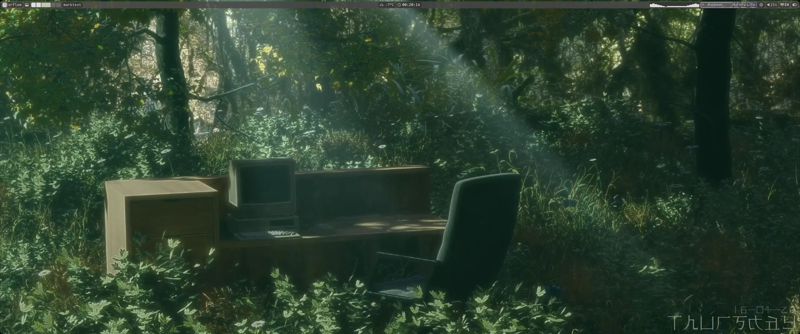
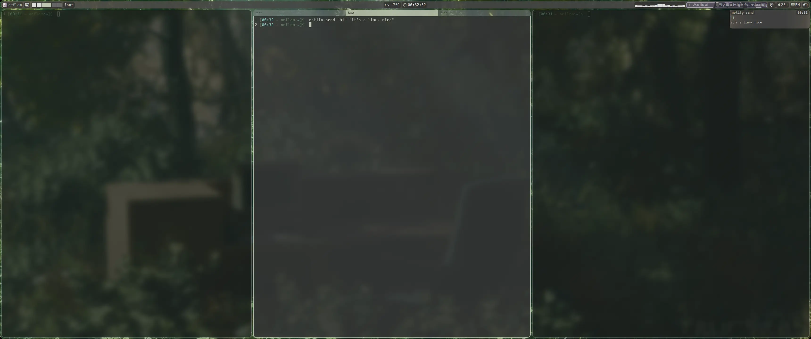

### Wallpaper selection
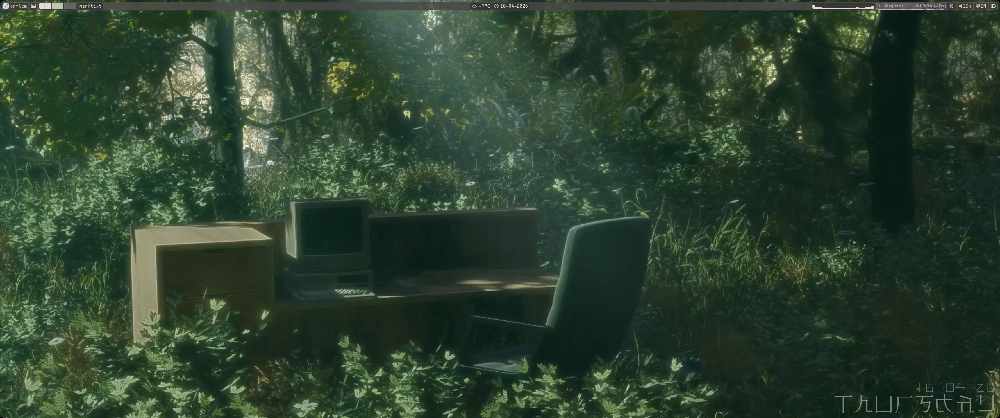

### Player
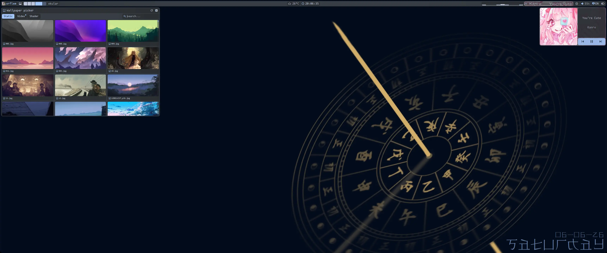
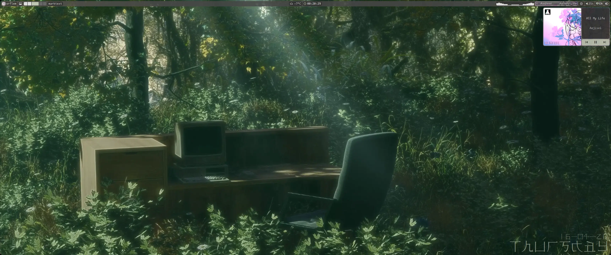

### Power buttons
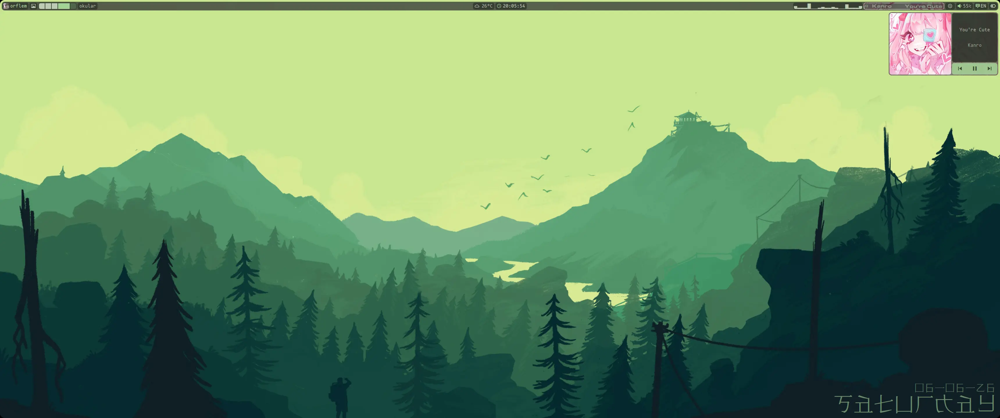

### Jwindow
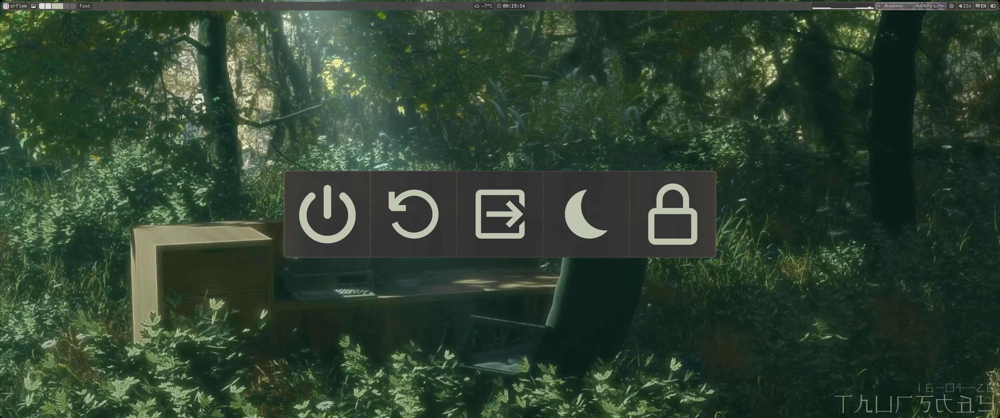

### Volume and brightness popup
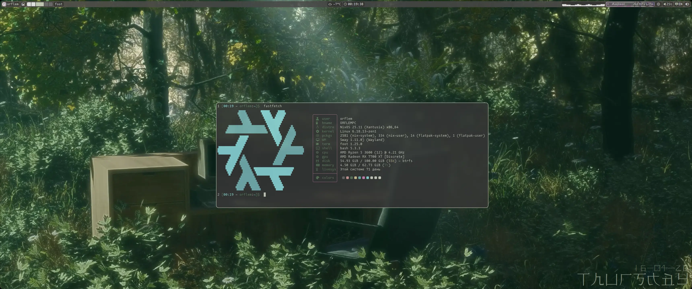

### Application launcher
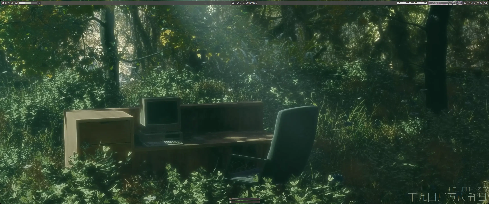

### Lock screen
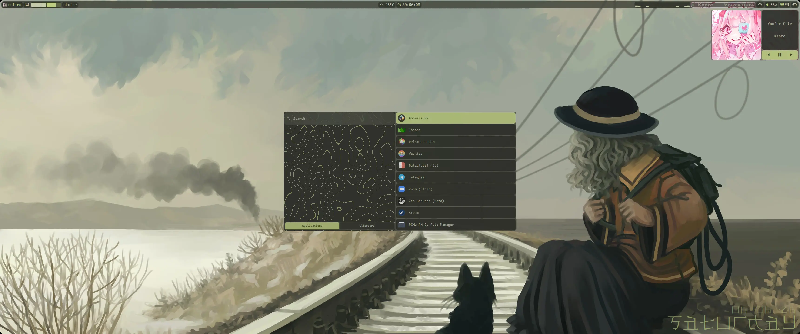


\* Screenshots taken on the [author's dotfiles](https://github.com/ORFLEM/dots)

## -- Plugins --:
### Installation
```
1. open ~/.config/JES/
2. drop the plugin folder in
3. open config.toml
4. add these lines:
   [[plugin]]
   name = "plugin name" # data in property name from manifest.json
   active = true
```

### [Detailed plugin creation guide](./plugins_eng.md)

### [Plugin repository](./plugin_repo.md)
### Important: the repository is English-only because this part is heavily influenced by the project community, and translating all short descriptions into different languages is unbearably difficult.

## -- JES installation --:
### NixOS
- In `flake` add:
```nix
{{
	inputs = {{
    jes.url = "github:ORFLEM/just_enough_shell";
	}}
	outputs = {{ your inputs, jes, ... }}@inputs:
  let
    system = "x86_64-linux";
    hostname = "nixos";

    specialArgs = {{ inherit inputs system hostname; }};

  in {{
    nixosConfigurations.${{hostname}} = nixpkgs.lib.nixosSystem {{
      inherit system specialArgs;
      modules = [
				jes.nixosModules.default
			];
		}};
	}};
}}
```
- rebuild the flake
- In `configuration.nix` add:
```nix
services.jes = {{
  enable = true;
  users = [ "your user" ];
}};
```
- rebuild NixOS

### Arch Linux or Arch based (may be incorrect; in case of problems, write to [Issue](https://github.com/ORFLEM/just_enough_shell/issues/new))
- Install Arch Linux (for simplicity I recommend EndeavourOS)
<!-- - Run the installer (not reworked): -->
<!-- ```bash -->
<!-- git clone https://github.com/ORFLEM/just_enough_shell.git && cd just_enough_shell && ./install_arch.sh -->
<!-- ``` -->

<!-- - In case of errors install manually: -->
- Installation is manual only, automatic is broken:
```
1. Install Arch Linux (for simplicity I recommend EndeavourOS)
2. Install yay or paru (yay: git clone https://aur.archlinux.org/yay.git && cd yay && makepkg -si)
3. Install official software (sudo pacman -Syu && pacman -S $(cat ./installer/arch_official.txt))
4. Install user software (yay -S $(cat ./installer/arch_aur.txt))
```

## -- License --:
Notifications were taken from the [blxshell](https://github.com/binarylinuxx/dots) project and modernized both visually and partially technically; notification license — **GNU GPL v3**
I recommend checking it out.

These configurations are distributed under the **BSD 3-Clause License**.

In simple terms this means:
- You can do anything with the code, but the author retains copyright on the project.
- You are required to indicate the original project and author in a fork, even if it is closed-source.
- You may not use the author's persona (nickname, other mentions) to promote your version of the project without permission.

This guarantees that the author's name and project will always be credited, and the author's name will not become a tool for promoting other forks.

Full license text see in the [LICENSE](./LICENSE) file.

##### Created by [\_ORFLEM\_](https://github.com/ORFLEM)

##### Translated by [Kimi K3](https://www.kimi.com/en?chat_enter_method=new_chat)
